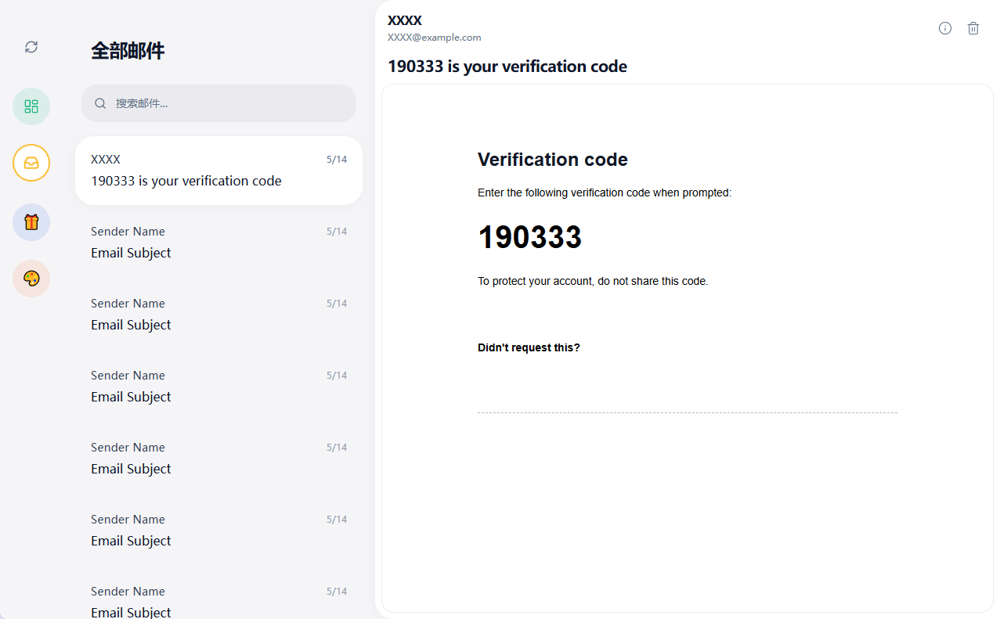
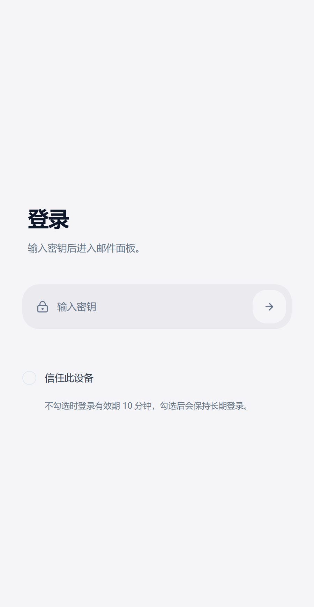
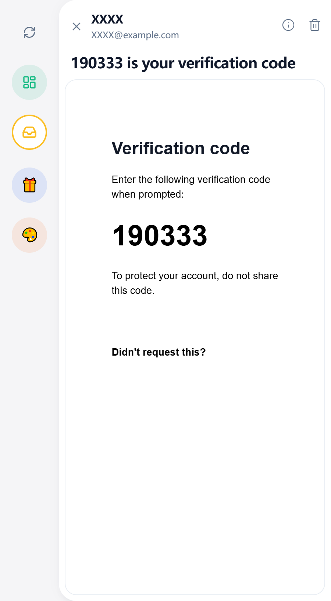

  

  <h1>Alle</h1>

  <a href="/README.md" style="margin-right: 5px">简体中文</a> | English

---

## 🌟 Overview

**Alle** is an **email aggregation and management platform** designed specifically for individual users.
By integrating the **email forwarding features** of various email service providers, Alle enables **centralized reception and unified management** of emails across multiple accounts, allowing users to stay informed without frequently switching between email platforms.

With a focus on minimalist design and intelligent recognition, Alle makes email management more efficient, clearer, and more secure.

---

## 🖼️ Interface Preview

### Desktop

  |  | 
| ---- | ---- | ---- |

### Mobile
  |  | 
| ---- | ---- | ---- |

---

## 🚀 Key Features

### 📬 Email Aggregation

Alle achieves aggregation through the **automatic forwarding features** of various email service providers.
Users only need to set up forwarding rules in their original email accounts to automatically send emails to the dedicated address provided by the Alle platform,
allowing them to view all email inbox content from a single interface.

> ✅ Supports Gmail, Outlook, QQ Mail and other major email providers
> ✅ Supports forwarding configuration for custom domain emails
> ✅ No need to enter email passwords, safe and reliable

This aggregation approach avoids the hassle of logging into multiple platforms and reduces security risks, easily achieving "receive all emails in one place".

---

### 🤖 AI Recognition

Alle's built-in AI engine analyzes email content and automatically identifies and extracts key information.

**Recognition includes:**
- 🔐 **Verification codes**: Automatically identifies and extracts verification code content, supporting quick copy and use.
- 🔗 **Link identification and classification**: Intelligently distinguishes different types of links in emails:
  - 📨 **Verification links**: Used for registration, login confirmation, identity verification and other scenarios (such as logging into GitHub, verifying new devices).
  - ⚙️ **Service links**: Identifies notification links from services like GitHub, GitLab, Notion (such as commits, pull requests, task changes, etc.).
  - 🚫 **Subscription links**: Identifies unsubscribe or preference management links in advertising marketing emails, helping users quickly clean up unnecessary subscriptions.

The AI recognition feature makes email reading more intuitive, allowing users to complete operations directly from the extracted results, greatly improving the user experience.

---

### 📨 Temporary Email Service

With the domain email functionality of **Cloudflare Workers**, Alle allows users to quickly create **unlimited temporary email addresses**.

These temporary email addresses can be used for:
- 🧾 Receiving verification codes when registering for websites or services
- 🕵️‍♂️ Keeping the primary email privacy secure
- ⚡ Temporarily receiving one-time information or test emails

All emails received by temporary email addresses are automatically integrated into the main interface for unified management, avoiding missed messages.

---

## 🛠️ Technical Highlights

- 🌩️ **Built on Cloudflare Workers**:
  Alle only requires one domain to deploy, no additional servers or complex environment configuration needed,
  fully utilizing the high availability and low latency features of edge computing.

- ⚙️ **Next.js Architecture**:
  Developed using the **Next.js** framework with high-performance rendering capabilities and excellent development experience,
  supporting Server-Side Rendering (SSR) and Static Site Generation (SSG) to ensure fast and stable page loading.

- 📱 **Multi-platform Adaptive Design**:
  Using responsive layout and Tailwind CSS style system,
  providing consistent and smooth interactive experience for both desktop and mobile platforms.

---

## 🧭 Deployment Guide

Alle's deployment process is extremely simple, requiring only one domain to run on Cloudflare Workers.

---

## 💡 Vision

Alle is committed to becoming a new generation of **personal email center**. Through intelligent aggregation, AI assistance, and lightweight deployment,
we enable users to enjoy efficient, simple, and private email management experience at minimal cost.

---

  <b>📧 Alle —— Making emails smarter and simpler.</b>

